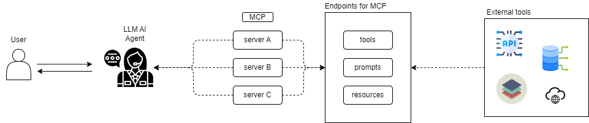

# MCP Demo: Self-Hosted AI Pipeline for Privacy-First Applications

A demonstration of how Model Context Protocol (MCP) enables secure, self-hosted AI services that keep sensitive data within trusted environments. This weather service demo showcases the architectural patterns needed for privacy-critical applications like Rider Spoke.

## 🎯 Core Demonstration

This project proves the viability of self-hosted AI pipelines by:

- Running local LLMs (Llama 3.2, Falcon3) without external API dependencies
- Implementing secure tool integration via MCP protocol
- Processing real-time data while maintaining privacy boundaries
- Demonstrating modular, API-driven architecture suitable for creative applications

## 🏗️ Architecture: Privacy-First AI Services


### Key Privacy Principles Demonstrated:

- ✅ No data leaves local environment
- ✅ Self-hosted models with full control
- ✅ Modular tool architecture for easy extension
- ✅ Secure internal APIs only

### 🎯 Current functionality
This project showcases how MCP enables seamless integration between Large Language Models and external APIs. The demo consists of:

- **MCP Server**: Exposes weather tools (alerts & forecasts) via standardized MCP protocol
- **LLM Client**: Uses PraisonAI Agents with local Ollama models to interact with weather tools
- **Real-time Data**: Fetches live weather information from the US National Weather Service

### Get started: Prerequisites
#### System Requirements

- Linux Operating System (Ollama is optimized for Linux environments)
- Python 3.8 or higher
- Git (for cloning the repository)

#### Ollama Installation

```bash
# Before running this project, you need to install Ollama on your Linux system:
curl -fsSL https://ollama.com/install.sh | sh
```
Alternatively, you can download and install Ollama manually from [ollama.com](https://ollama.com/download/linux)

#### Verify Ollama Installation
```bash
ollama --version
```
#### Configuration
Ollama Models
Before using the system, you may need to pull specific models:
```bash
# Example: Pull a popular model
ollama pull llama3.2

# List available models
ollama list

# Remove a model if needed
ollama rm <model-name>
```

#### installation
```bash
1. Clone the Repository
git clone https://github.com/ammarameenn/MCP.git
cd MCP/
2. Create Virtual Environment (Recommended)
python -m venv venv # or python3 depending on your installation
source venv/bin/activate  # On Linux
3. Install Dependencies
pip install -r requirements.txt
```

#### Project Structure
MCP
├── server.py          # MCP server implementation
├── client.py          # Client for testing server connectivity
├── requirements.txt   # Python dependencies
├── .gitignore        # Git ignore patterns
└── README.md         # This file

#### Quick Start
Follow these steps to get the system running:
Step 1: Start the MCP Server
```bash
#Open your first terminal and run:
python server.py
# The server will start and listen for incoming connections. You should see output indicating the server is running.
```
Step 2: Start Ollama Service
```bash
# Open a second terminal and start the Ollama service:
ollama serve
#This command starts the Ollama daemon that will handle model inference requests. Keep this terminal open while using the system.
```
Step 3: Test the Connection
```bash
# Open a third terminal and run the client to test the connection:
python client.py
#This will verify that your MCP server can successfully communicate with Ollama.
# Now you are ready to ask questions to your agent with custom tools
```


### 📋 Example Interactions
#### Weather Alerts Query
```
🧑 You: Check weather alerts for Florida
🤖 Agent: I'll check the current weather alerts for Florida.

Current active alerts for FL:

Event: Hurricane Warning
Area: Southeast Florida
Severity: Extreme
Description: Hurricane conditions expected within 36 hours...
Instructions: Complete preparations immediately...
Forecast Query

🧑 You: What's the weather forecast for San Francisco? (37.7749, -122.4194)
🤖 Agent: Here's the 5-day forecast for San Francisco:

Tonight:
Temperature: 58°F
Wind: 10 mph W
Forecast: Partly cloudy with patchy fog developing after midnight...
```